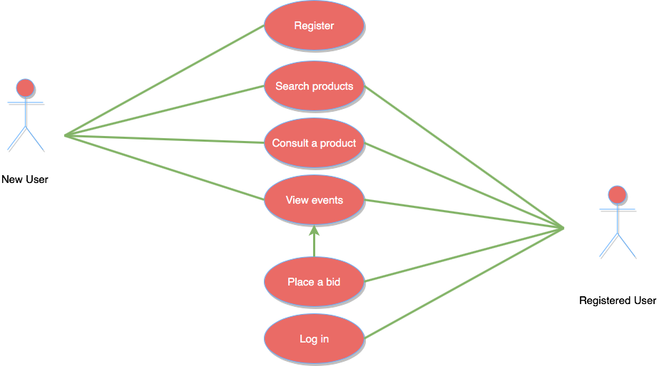
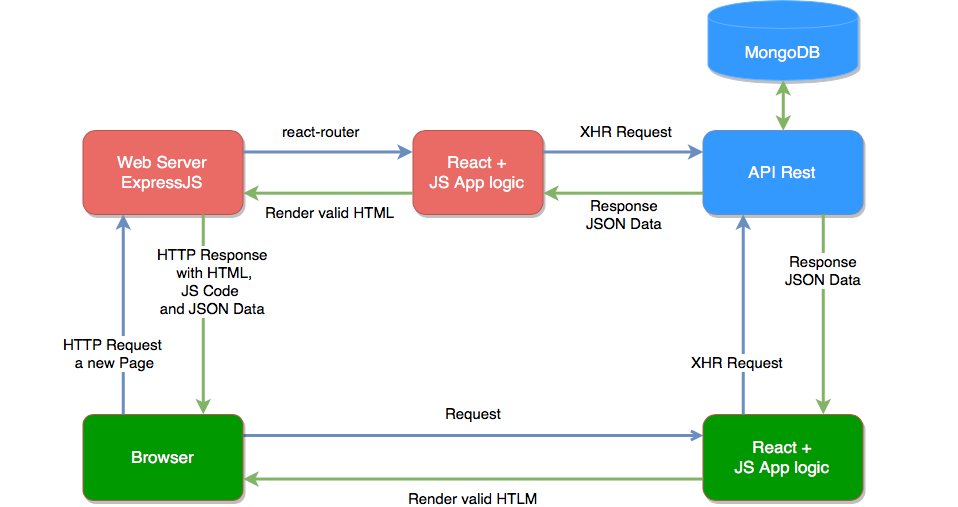
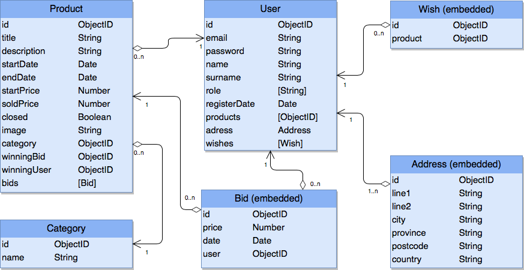

# Isomorphic SSR + React + Redux Auction Demo App

## Functional description

### This project explores how to do an Isomorphic Server Side Rendering App with React + Redux combined with events on client side with socket.io 

Demo: [Demo App](https://intense-plains-98825.herokuapp.com/)

 

## Architecture

## Data model

